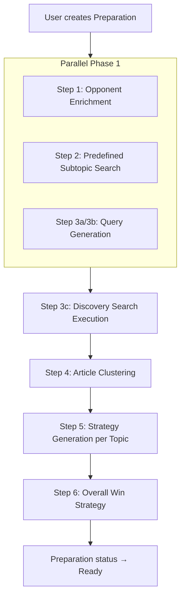

# Preparation Strategy Generation Pipeline

## Overview

When the user creates a preparation and hits **Generate**, the backend runs a multi-step pipeline that enriches opponents, searches for relevant articles, discovers new subtopics, and generates debate strategy using LLM calls.

---

## Pipeline Steps



---

## Step 1: Opponent Enrichment

**Goal:** Automatically fill in opponent details from a simple name.

| Item | Detail |
|---|---|
| Input | Opponent name (string) |
| LLM Call | Gemini with **web search** enabled + **structured output** |
| Output | `{ description, organization, knownPositions, debateStyle }` |

- Runs once per opponent that lacks enrichment data.
- `description`: A short 1–2 sentence summary of who the opponent is.
- Updates the `Opponent` record in the database.
- Uses Gemini's grounded web search so results are factual and current.
- **Runs in parallel** with Steps 2 and 3a/3b (no dependencies).
- **Error resilient:** If enrichment fails for one opponent, the pipeline continues. The opponent stays unenriched.

---

## Step 2: Predefined Subtopic Article Search

**Goal:** Find articles for each user-defined strategy topic.

| Item | Detail |
|---|---|
| Input | Each strategy topic's `title`, `description`, `stance` + opponent names + debate context |
| API Call | Newsmatics hybrid search per topic |
| Output | List of articles (`article_id`, `title`, `content`, `url`) per topic |

- The found articles are stored directly on the subtopic (`articleIds`).
- These articles are then passed to Step 5 for strategy generation.
- **Runs in parallel** with Steps 1 and 3a/3b.
- Predefined-topic article IDs are tracked so they can be **excluded from clustering** in Step 4.

---

## Step 3: Dynamic Topic Discovery

**Goal:** Discover subtopics the user hasn't thought of by querying beyond the predefined topics.

### 3a. Predefined Queries

A set of general queries derived from the preparation context:
- `"{main_topic} controversy"`
- `"{main_topic} {opponent_name} scandal"`
- `"{main_topic} criticism"`
- `"{opponent_name} {debate_context}"`

### 3b. LLM-Generated Queries

| Item | Detail |
|---|---|
| Input | Main topic, user position, opponents, debate context |
| LLM Call | Gemini — structured output returning `list[str]` of search queries |
| Output | 3–6 additional search queries |

The LLM is prompted to think like a debate researcher: what angles, weak points, or news would be useful?

**Steps 3a and 3b run in parallel** with Steps 1 and 2.

### 3c. Search Execution

All queries (predefined + LLM-generated) are sent to the **Newsmatics API**. Results are collected and deduplicated by `article_id`.

**Articles already found in Step 2** (predefined topics) are excluded from the discovery pool to avoid redundant clustering.

---

## Step 4: Article Clustering

**Goal:** Group the discovered articles into coherent subtopics.

| Item | Detail |
|---|---|
| Input | Articles from Step 3 (excluding Step 2 articles) + **predefined topic names** as context |
| LLM Call | Gemini — **structured output** |
| Output | `dict[str, list[str]]` — topic name → list of article IDs |

- The LLM reads article titles/snippets and groups them into logical debate subtopics.
- **Predefined topic names are passed as context** so the LLM avoids creating overlapping clusters (e.g. won't create "Tax Reform" if user already has "Tax Policy").
- Each cluster becomes a new `StrategyTopic` with `source: "discovered"` and its article IDs pre-filled.
- **Error resilient:** If clustering fails, the pipeline skips discovery and continues with predefined topics only.

Example output:
```json
{
  "Tax Evasion Allegations": ["article-1", "article-5"],
  "Voting Record on Healthcare": ["article-2", "article-3", "article-7"],
  "Lobbying Connections": ["article-4", "article-6"]
}
```

---

## Step 5: Strategy Generation per Topic

**Goal:** For each subtopic (both user-defined and discovered), generate the full debate strategy.

| Item | Detail |
|---|---|
| Input | Topic title, description, stance, relevant articles, **enriched opponent profiles**, debate context |
| LLM Call | Gemini — structured output |
| Output | `{ sneakyQuestions[], arguments[], whyBadForOpponent }` |

- `sneakyQuestions`: 3–5 pointed questions to put the opponent on the spot, informed by the articles.
- `arguments`: 3–5 evidence-backed arguments the user can make.
- `whyBadForOpponent`: Paragraph explaining why this topic is disadvantageous for the opponent.
- **Enriched opponent data** (from Step 1) is included in the prompt so the LLM can craft targeted strategy (e.g. *"Given their known position on X..."*).
- This runs for **every** subtopic — both user-predefined (Step 2) and newly discovered (Step 4).
- **Error resilient:** If generation fails for one topic, it's marked as failed and the pipeline continues with the remaining topics.

---

## Step 6: Overall Win Strategy Synthesis

**Goal:** Generate a high-level win strategy and key arguments for the entire preparation.

| Item | Detail |
|---|---|
| Input | All generated subtopics (questions, arguments, analysis) + enriched opponents + debate context |
| LLM Call | Gemini — structured output |
| Output | `{ winStrategy, keyArguments[] }` |

- Synthesizes all subtopic strategies into a cohesive overall game plan.
- `winStrategy`: A paragraph describing the recommended approach to win the debate.
- `keyArguments`: 3–5 top-level arguments that tie the subtopics together.
- Updates the Preparation's `winStrategy` and `keyArguments` fields.
- Sets preparation status to **Ready**.

---

## Data Flow Summary

```
User Input                          Backend Pipeline                           Output
─────────────                       ────────────────                           ──────
                                    ┌─ PARALLEL ──────────────────────┐
Opponent names          →  Step 1   │  Enriched opponent profiles     │
Predefined subtopics    →  Step 2   │  Articles per predefined topic  │
Debate context/topic    →  Step 3ab │  Discovery queries              │
                                    └─────────────────────────────────┘
                           Step 3c  →  Discovered articles (deduplicated, excl. Step 2)
                           Step 4   →  Clustered into new subtopics (aware of predefined)
All subtopics + articles → Step 5   →  Questions, arguments, analysis (with enriched opponents)
All strategies          →  Step 6   →  Overall win strategy + key arguments → Status: Ready
```

---

## StrategyTopic Source Field

Each strategy topic has a `source` field to distinguish its origin:

| Source | Meaning | UI Treatment |
|---|---|---|
| `user` | Created by the user in the preparation form | Shown normally |
| `discovered` | Generated by the pipeline via article clustering | Shown with a ✨ Discovered badge |

---

## Implementation Notes

- All LLM calls use **structured output** (Gemini's JSON schema response) to ensure parseable results.
- Opponent enrichment uses **web search grounding** — other calls do not.
- **Steps 1, 2, and 3a/3b run concurrently** via `asyncio.gather()` to minimize latency.
- Article deduplication happens by `article_id` before clustering.
- Articles from Step 2 are excluded from the clustering pool in Step 4.
- The clustering LLM receives predefined topic names to avoid creating overlapping clusters.
- Discovered subtopics are appended alongside user-defined ones (not replacing them).
- **Error resilience:** Each step catches its own errors. A failure in one opponent, topic, or step does not abort the pipeline — partial results are saved and failures are logged.
- The entire pipeline is triggered by `POST /api/preparations/{id}/generate`.

---

## Logging

Every step logs its progress so the pipeline is observable:

| Step | Log Examples |
|---|---|
| Step 1 | `🔍 Enriching opponent: John Doe` · `✅ Opponent enriched: John Doe — CEO of Acme Corp` |
| Step 2 | `📰 Searching articles for predefined topic: Tax Policy` · `Found 5 articles` |
| Step 3 | `🤖 Generating discovery queries...` · `🔎 Running query: "opponent scandal"` · `Found 12 unique articles (deduplicated, 3 excluded from Step 2)` |
| Step 4 | `🗂️ Clustering 12 articles into subtopics (excluding predefined: Tax Policy, Healthcare)...` · `Discovered 3 new subtopics` |
| Step 5 | `⚔️ Generating strategy for topic: Tax Policy (5 articles, 2 enriched opponents)` · `✅ Strategy complete` |
| Step 6 | `🎯 Synthesizing overall win strategy from 5 topics...` · `✅ Win strategy generated` |
| Final | `✅ Pipeline complete for "Prep Title" — 5 topics (2 user, 3 discovered)` |
| Errors | `⚠️ Opponent enrichment failed for Jane Smith — skipping` · `⚠️ Strategy generation failed for topic: Lobbying — continuing` |

---

## Code Gaps (Plan vs Codebase)

The following mismatches exist between this plan and the current code. These must be fixed during implementation.

### 1. Missing `description` field on Opponent model

The plan adds a `description` field to opponent enrichment output, but the codebase is missing it.

| File | Change |
|---|---|
| `models.py` → `Opponent` | Add `description = Column(Text, nullable=True)` |
| `schemas.py` → `OpponentBase` | Add `description: Optional[str] = None` |
| `crud.py` → `get_all_opponents` / `_prep_to_response` | Include `description` in response dicts |
| `types/index.ts` → `Opponent` | Add `description?: string` |

### 2. Missing `source` field on StrategyTopic model

The plan introduces `source: 'user' | 'discovered'` but no code has it.

| File | Change |
|---|---|
| `models.py` → `StrategyTopic` | Add `source = Column(String, default="user")` |
| `schemas.py` → `StrategyTopicBase` | Add `source: str = "user"` |
| `crud.py` | Include `source` in serialization and creation |
| `types/index.ts` → `StrategyTopic` | Add `source: 'user' \| 'discovered'` |
| `PrepDetail.tsx` | Show ✨ badge for discovered topics |

### 3. `main.py` generate endpoint is not parallelized

Current `generate_strategy()` runs everything sequentially. The plan says Steps 1, 2, 3a/3b should run concurrently.

| File | Change |
|---|---|
| `main.py` → `generate_strategy` | Use `asyncio.gather()` for opponent enrichment, predefined search, and query generation |

### 4. No dynamic topic discovery (Steps 3 + 4) implemented

The current `main.py` only does Step 2 (predefined search) + Step 5 (strategy gen). There is no:
- Predefined query generation (Step 3a)
- LLM query generation (Step 3b)
- Discovery search execution (Step 3c)
- Article clustering (Step 4)

These need to be implemented as new functions in `llm.py` and `newsmatics.py`.

### 5. No Step 6 (win strategy synthesis) implemented

The current pipeline sets status to Ready but never populates `winStrategy` or `keyArguments`. A new LLM call is needed after all topics are generated.

### 6. No error resilience

Current code has a single try/except around the entire pipeline. Per the plan, each step should catch its own errors so partial results are saved.

### 7. Opponent enrichment not implemented

Step 1 (enriching opponents via Gemini + web search) has no implementation. Needs a new function in `llm.py` using Gemini with `google_search` tool.

